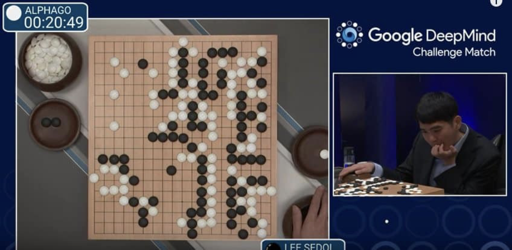
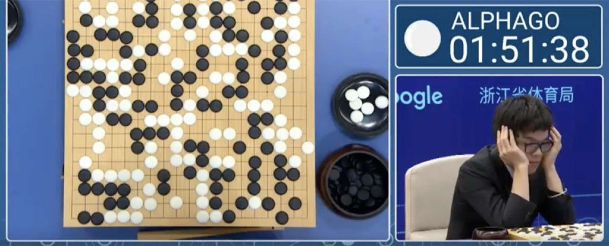
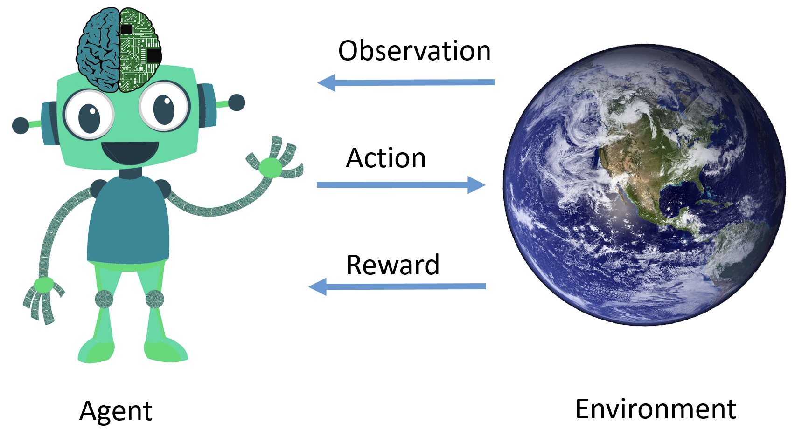
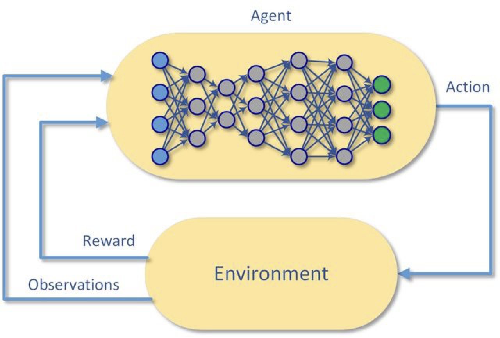
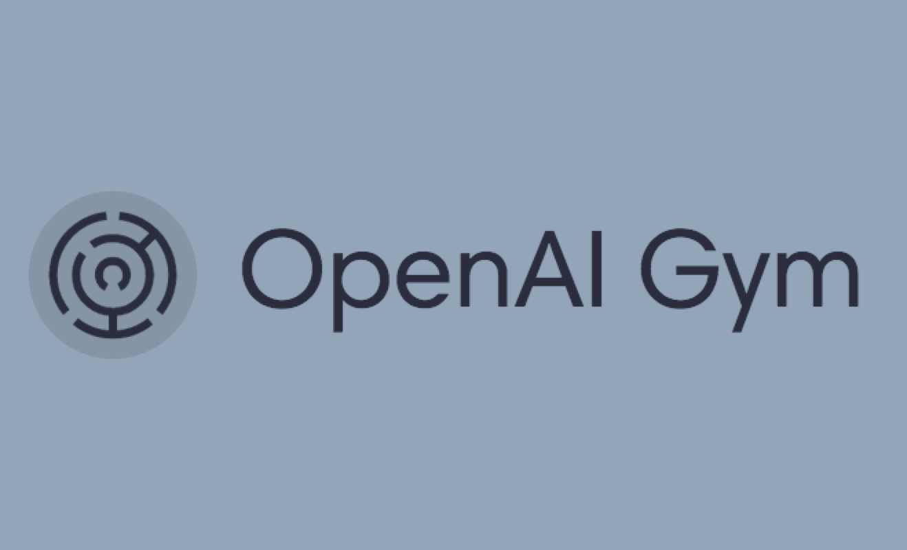
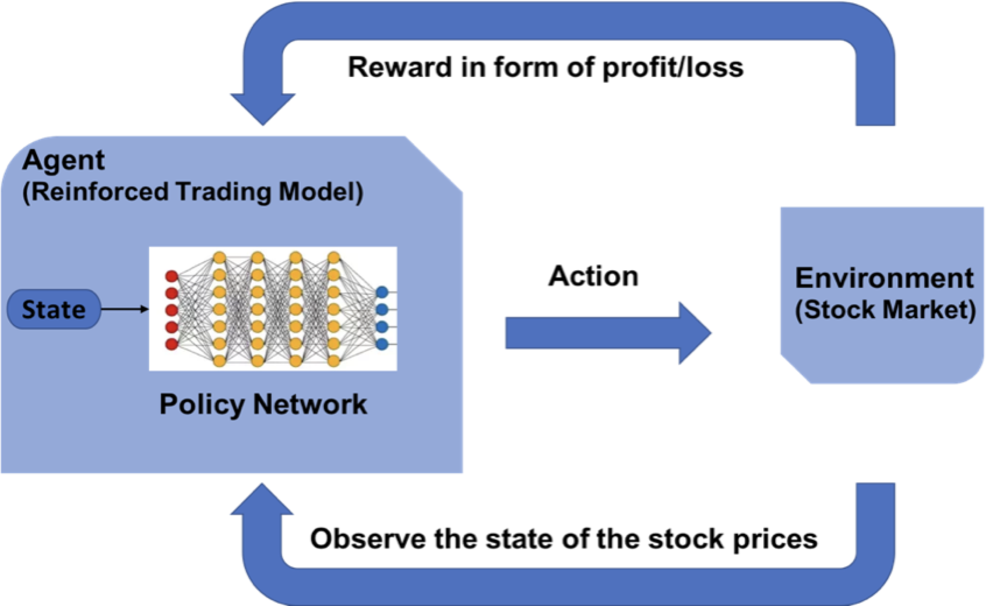
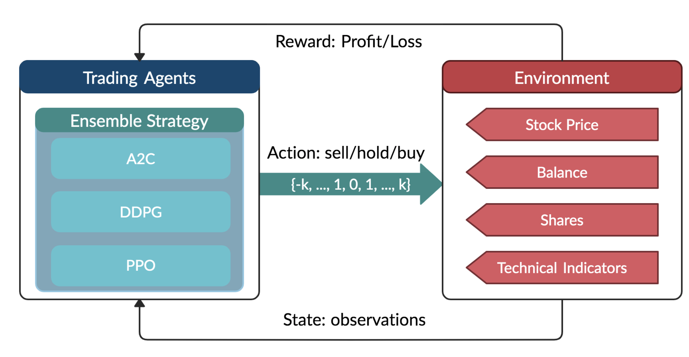

# Overview

Initially, we were using machine learning and AI to simulate how humans think, only a thousand times faster! The human brain is complicated but is limited in capacity. This simulation was the early driving force of AI research. But we have reached a point today where humans are amazed at how AI “thinks”.

A quote sums it up perfectly, “AlphaZero, a reinforcement learning algorithm developed by Google’s DeepMind AI, taught us that we were playing chess wrong!”

While most chess players know that the ultimate objective of chess is to win, they still try to keep most of the chess pieces on the board. But AlphaZero understood that it didn’t need all its chess pieces as long as it was able to take the opponent’s king. Thus, its moves are perceived to be quite risky but ultimately they would pay off handsomely.

AlphaZero understood that to fulfil the long term objective of checkmate, it would have to suffer losses in the game. We call this delayed gratification. What’s impressive is that before AlphaZero, few people thought of playing in this manner. Ever since various experts in a variety of disciplines have been working on ways to adapt reinforcement learning in their research. This exciting achievement of AlphaZero started our interest in exploring the usage of reinforcement learning for trading.

## AlphaGo and DRL

  

  

## Deep Reinforcement Learning with OpenAI Gym

  

  

  

  

## Deep Reinforcement Learning for Trading

  

  
