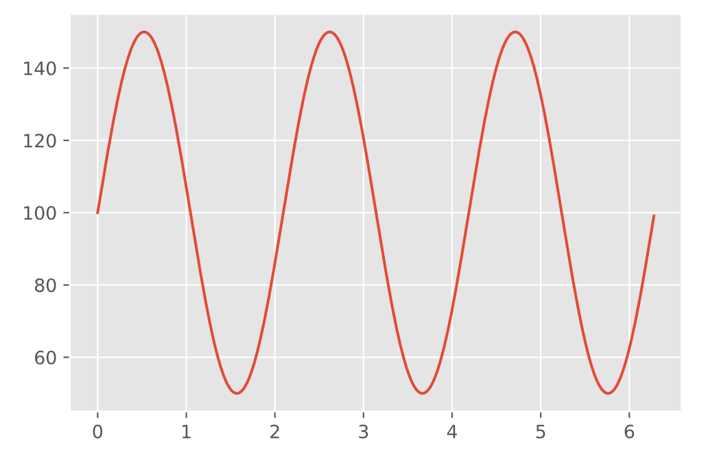

# Sample Data


## Generate simulated data

```
import numpy as np
import pandas as pd
import matplotlib.pyplot as plt
x = np.arange(0, 2*np.pi, 2*np.pi / 1001)
y = 50*np.sin(3*x) + 100

plt.plot(x,y)

```

  
